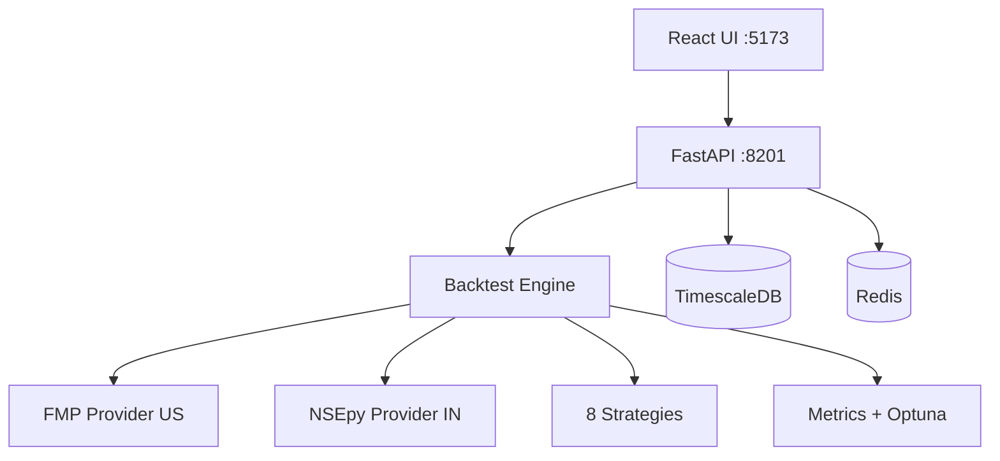

# AvaAI Backtester

Multi-market quantitative trading research platform.

## Features

- **8 Built-in Strategies** — SMA Crossover, RSI Mean Reversion, MACD Crossover, Bollinger Bands, Momentum Breakout, RSI + Volume Filter, Dual Momentum, Opening Range Breakout
- **Multi-Market** — USA (NYSE/NASDAQ) + India (NSE/BSE) with extensible market registry
- **Walk-Forward Analysis** — Out-of-sample validation to detect overfitting
- **Optuna Optimization** — Bayesian hyperparameter tuning with overfitting score
- **20+ Analytics Metrics** — Sharpe, Sortino, max drawdown, Calmar, portfolio correlation, and more
- **Real-Time WebSocket Progress** — Live updates streamed to the UI during backtests
- **React UI** — Modern frontend with strategy builder, market selector, and interactive charts
- **Look-Ahead Bias Prevention** — Temporal DataWindow ensures strategies only see past data

## Architecture



## Quickstart

```bash
# 1. Clone and enter the project
git clone <repo-url> && cd ava-backtest-api

# 2. Copy environment template
cp .env.example .env

# 3. Fill in your API keys in .env
#    Required: FMP_API_KEY (for US market data)
#    Optional: UPSTOX/ZERODHA keys (for India), ALPACA keys, OPENROUTER_API_KEY

# 4. Start all services
docker compose up

# 5. Open the UI
#    http://localhost:5173
```

## API Endpoints

| Method | Endpoint | Description |
|--------|----------|-------------|
| `POST` | `/api/v2/backtest` | Run a backtest |
| `GET` | `/api/v2/backtest/{id}` | Get backtest results |
| `GET` | `/api/v2/strategies` | List available strategies |
| `GET` | `/api/v2/markets` | List supported markets |
| `POST` | `/api/v2/optimize` | Run Optuna optimization |
| `GET` | `/api/v2/analytics/{id}` | Get detailed analytics |
| `WS` | `/ws/backtest/{id}` | Real-time backtest progress |

## Strategies

| Strategy | Description |
|----------|-------------|
| **SMA Crossover** | Buy when fast SMA crosses above slow SMA, sell on cross below |
| **RSI Mean Reversion** | Buy oversold (RSI < 30), sell overbought (RSI > 70) |
| **MACD Crossover** | Trade MACD line / signal line crossovers with histogram confirmation |
| **Bollinger Bands** | Mean reversion on band touches with squeeze detection |
| **Momentum Breakout** | Enter on N-day high breakouts with volume confirmation |
| **RSI + Volume Filter** | RSI signals filtered by above-average volume |
| **Dual Momentum** | Combine absolute and relative momentum for trend following |
| **Opening Range Breakout** | Trade breakouts from the first N-minute range |

## Adding a New Market

Four-step playbook (see [MULTI_MARKET_DESIGN.md](docs/MULTI_MARKET_DESIGN.md) for details):

1. **Add to registry** — Add a `MarketCode` enum entry and `MarketConfig` in `src/core/markets/registry.py`
2. **Implement provider** — Create a `DataProvider` subclass in `src/core/data/providers/`
3. **Insert universes** — Run SQL to add default symbol universes for the new market
4. **Set env var** — Add any new API keys to `docker-compose.yml` and `.env.example`

Everything else auto-configures: the `/api/v2/markets` endpoint, UI market selector, backtests, trades, analytics — all scoped to the new market automatically.

## Adding a New Strategy

1. Create a file in `src/strategies/classic/` (or `modern/`, `experimental/`)
2. Subclass `StrategyBase` from `src/core/strategy/base.py`
3. Implement `generate_signals(window: DataWindow) -> list[Signal]`
4. Register in `src/core/strategy/registry.py`

## Tech Stack

- **Backend** — FastAPI, Polars, SQLAlchemy 2.0, asyncpg
- **Database** — TimescaleDB (PostgreSQL 15 + time-series extensions)
- **Cache** — Redis 7 with LRU eviction
- **Optimization** — Optuna 3.5 with Bayesian TPE sampler
- **Frontend** — React + Vite
- **Infrastructure** — Docker Compose, GitHub Actions CI

## Development

```bash
# Install in dev mode
pip install -e ".[dev]"

# Run tests
pytest tests/unit/ -x -q

# Lint
ruff check src/
mypy src/ --ignore-missing-imports
```

## License

MIT
