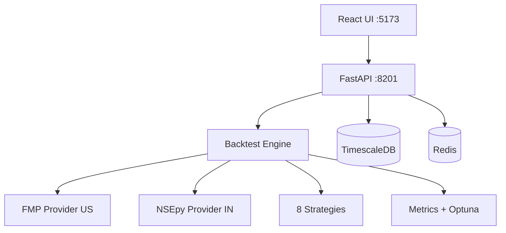

# Architecture

## System Overview

## Components

| Component | Description |
|-----------|-------------|
| **React UI** | Frontend on port 5173 with real-time WebSocket progress |
| **FastAPI** | REST + WebSocket API on port 8201 |
| **Backtest Engine** | Core execution with DataWindow, Portfolio, FillSimulator |
| **TimescaleDB** | Time-series storage for OHLCV, trades, and analytics |
| **Redis** | Caching layer for market data and computation results |
| **FMP Provider** | US market data (NYSE/NASDAQ) via Financial Modeling Prep |
| **NSEpy Provider** | India market data (NSE/BSE) via nsepy |
| **Strategies** | 8 built-in strategies (SMA, RSI, MACD, BB, Momentum, RSI+Vol, Dual Momentum, ORB) |
| **Analytics** | 20+ metrics, walk-forward analysis, Optuna hyperparameter optimization |

## Data Flow

1. User selects strategy, market, and parameters in React UI
2. FastAPI receives request and validates via Pydantic V2 models
3. Engine fetches OHLCV data from the appropriate market provider (FMP for US, NSEpy for India)
4. DataWindow prevents look-ahead bias by exposing only data available at each point in time
5. Strategy generates signals, FillSimulator executes with realistic cost models
6. Analytics compute 20+ metrics including Sharpe, Sortino, max drawdown, and overfitting score
7. Results stream back to the UI via WebSocket in real-time
